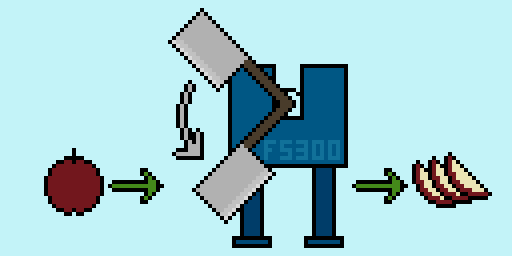

# Concepts: What is Fuzzing?

**Fuzzing** is a software testing and security technique that involves giving a program unexpected input, with the intention of crashing the program or altering its behavior. It's somewhat comparable to unit testing, but there's an important difference.

## An Analogy: Slicing Fruit

Let's say you've created a machine, and you've called it the "fruit slicer." You created it to accomplish one specific task: cut fruit into slices. You can put fruit in it, and it's supposed to cut it up and spit the fruit slices out. (In our analogy, the fruit slicer is like a C program.)
  
Now, to make sure this fruit slicer works correctly, you decide it's best to test it out on various types of fruits. You put in an apple, a pear, a peach, some grapes, a banana, and every other fruit you can get your hands on. The fruit slicer works great! (This would be considered **unit testing**.)


  
At this point, you might think your machine is perfect: it cuts every kind of fruit flawlessly. Enter, fuzzing. Take the fruit and surround it by a bunch of rocks, then glue it together and bake it in the oven for twelve hours. We've "mutated" the original input to be something odd and unexpected. Will your machine break?


  
Now, mutate something else (or the same input a second time), and try it again. Now do it again. Over and over. This is fuzzing: creating unexpected inputs and feeding it to our target repeatedly, in some automated fashion. By fuzzing, we can uncover bugs that might later be revealed by attackers or flawed inputs. Identifying such bugs and fixing them will make our programs more robust and secure.

## Fuzzing HTTP Servers

Since this project is about writing a HTTP server, let's look at a simple example of what fuzzing might look like with HTTP messages. Consider this simple message:

```
GET /index.html HTTP/1.1
Host: localhost:13650
User-Agent: Mozilla/4.0
Connection: Keep-Alive
```

This is a simple GET request we might send to a HTTP server to retrieve the contents of `index.html`. Any correctly-implemented server should handle this just fine. What happens if we "fuzz" this input before sending it to the server?

```
GONT /index.htlol HTTP/1.111
H_?ost: localhost:13650
User-Agent: Mozilla/4.0
  
Conn---ection: Keep-Alivey
```

As is common with most fuzzers, the input was "mutated" to produce this odd, incorrect HTTP request message. Will your server see the `GONT` and recognize it as an invalid method? Will it realize `HTTP/1.111` is an invalid version number? If your program handles this badly, and ends up crashing or doing something it shouldn't, then fuzzing was a success. An attacker could take advantage of this vulnerability to bring your server down while it's doing important work. Of course, a proactive programmer could also take this knowledge and patch up the problem to prevent future crashes.
